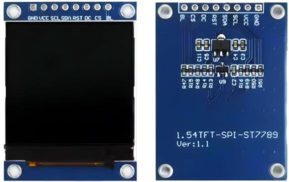
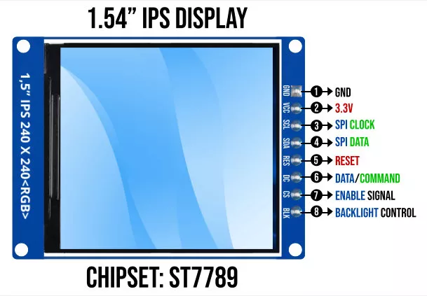
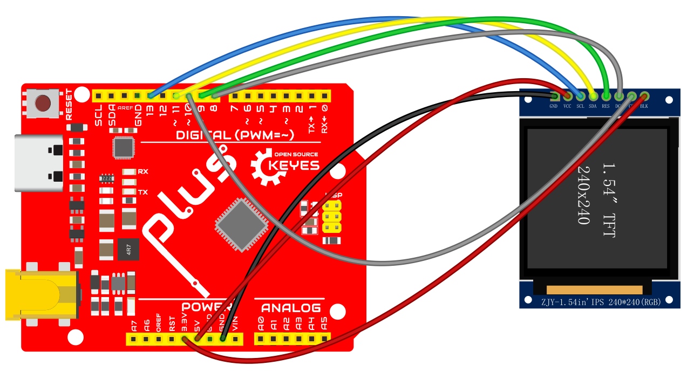

# 1.54英寸IPS显示模块


## 概述
1.54英寸IPS显示模块是一款高性能的TFT液晶显示屏，专为嵌入式系统设计，广泛应用于智能手表、可穿戴设备及消费电子产品。该模块具备RGB 65K色彩显示，能够提供丰富的视觉体验，且拥有全视角显示能力，确保在不同观看角度下图像依然清晰可见。

## 核心特点
- **高分辨率**：240x240像素的显示分辨率，确保图像和文本清晰锐利。
- **全视角能力**：采用IPS技术，有效提升观看角度，极大改善色彩的一致性和亮度。
- **简便的接口**：通过4线制SPI接口连接，简化了硬件连接过程，适配多种控制器。
- **兼容性**：模块与多种微控制器兼容，包括Arduino、STM32、C51等，可用于广泛的应用场景。
- **结构紧凑**：模块尺寸为1.54英寸，适合嵌入各种空间受限的设备。

## 产品参数

| **参数名**                | **参数值**                              |
|---------------------------|-----------------------------------------|
| **显示颜色**              | RGB 262K 彩色                            |
| **SKU**                   | MD0757                                 |
| **尺寸**                  | 1.54 英寸                               |
| **面板材质**              | TFT                                     |
| **驱动芯片**              | ST7789                                  |
| **分辨率**                | 240 x 240 像素                         |
| **有效显示区域**          | 27.72 x 27.72 mm                       |
| **触摸屏类型**            | 无触摸屏                                |
| **工作温度**              | -20℃ ~ 70℃                            |
| **存储温度**              | -30℃ ~ 80℃                            |
| **工作电压**              | 3.3V                                    |
| **产品重量**              | 10g（含包装）                           |

## 接口定义



| **序号** | **模块引脚** | **引脚说明**                          |
|----------|--------------|---------------------------------------|
| 1        | GND          | 液晶屏电源地（接地）                  |
| 2        | VCC          | 液晶屏电源正 (3.3V)                   |
| 3        | SCL          | SPI总线时钟信号                        |
| 4        | SDA          | SPI数据写入信号                        |
| 5        | RES          | 复位控制信号（低电平复位）              |
| 6        | DC           | 数据/寄存器选择信号（低电平为寄存器，高电平为数据） |
| 7        | CS           | 片选控制信号（低电平使能）              |
| 8        | BLK          | 背光控制信号（高电平点亮）             |

## 应用场景
1. **智能手表**：用于显示时间、健康数据和通知等信息。
2. **可穿戴设备**：在医疗和运动设备中显示实时数据。
3. **消费电子产品**：如迷你游戏机或智能家居控制面板上进行信息反馈。


# 1.54英寸IPS显示模块的Arduino教程

## 一、所需材料

在开始之前，请准备以下材料：

- **1.54英寸IPS显示模块**：此模块采用ST7789驱动芯片，具有高分辨率和良好的色彩表现。
- **Arduino开发板**：如Arduino Uno、Arduino Nano等。
- **跳线若干**：用于连接显示模块与Arduino。
- **USB数据线**：用于连接Arduino到计算机。

## 二、硬件连接

按照下表将1.54英寸IPS显示模块与Arduino开发板按引脚连接：

| **模块引脚** | **Arduino引脚**         | **引脚说明**                   |
|--------------|--------------------------|--------------------------------|
| GND          | GND                      | 电源地                      |
| VCC          | 5V                       | 电源正                      |
| SCL          | 13                       | SPI时钟信号                 |
| SDA          | 11                       | SPI数据传输引脚             |
| RES          | 9                        | 复位控制信号（低电平复位）   |
| DC           | 8                        | 数据/寄存器选择信号          |
| CS           | 10                       | 片选控制信号（低电平使能）    |
| BLK          | 3.3V                     | 背光控制信号（高电平开启）    |

**连接示例图**：



## 三、软件设置

1. **安装Arduino IDE**：
   - 访问[Arduino官方网站](https://www.arduino.cc/)下载并安装最新版本的Arduino IDE。

2. **安装必要的库**：
   - 在Arduino IDE中，导航到 `项目` →`导入库`→ `管理库`，搜索并安装以下库：
     - **Adafruit ST7735 and ST7789 Library**：用于控制TFT显示屏。
     - **Adafruit GFX Library**：提供基本的图形功能。

## 四、编写代码

打开Arduino IDE，创建一个新项目并输入以下代码：

```cpp
#include <Adafruit_GFX.h>
#include <Adafruit_ST7735.h>

// 引脚定义
#define TFT_CS     10  // 片选引脚
#define TFT_RST    9   // 复位引脚
#define TFT_DC     8   // 数据/命令引脚

// 创建显示对象
Adafruit_ST7735 tft = Adafruit_ST7735(TFT_CS, TFT_DC, TFT_RST);

void setup() {
  tft.initR(INITR_BLACKTAB); // 初始化显示屏
  tft.fillScreen(ST77XX_BLACK); // 清空屏幕为黑色

  // 设置文本样式
  tft.setTextColor(ST77XX_WHITE); // 设置文字颜色为白色
  tft.setTextSize(2); // 设置文字大小
  tft.setCursor(10, 10); // 设置光标位置
  tft.println("Hello, World!"); // 显示文本

  // 绘制图形示例
  drawShapes();
}

void loop() {
  // 主循环中不需要执行任何代码
}

// 绘制矩形、线条和圆形
void drawShapes() {
  // 绘制矩形
  tft.drawRect(20, 40, 100, 50, ST77XX_RED); // 画红色矩形
  tft.setTextColor(ST77XX_RED);
  tft.setCursor(30, 60);
  tft.println("Rect");

  // 绘制填充矩形
  tft.fillRect(130, 40, 80, 50, ST77XX_GREEN); // 画绿色填充矩形
  tft.setTextColor(ST77XX_GREEN);
  tft.setCursor(140, 60);
  tft.println("Filled");

  // 绘制线条
  tft.drawLine(0, 0, 240, 240, ST77XX_BLUE); // 从左上角到右下角的蓝色线条

  // 绘制圆形
  tft.drawCircle(120, 120, 30, ST77XX_YELLOW); // 画黄色圆形
  tft.fillCircle(120, 120, 15, ST77XX_ORANGE); // 画填充橙色圆形
  tft.setTextColor(ST77XX_ORANGE);
  tft.setCursor(100, 120);
  tft.println("Circle");
}
```

### 代码说明

1. **库导入**：代码开始时导入了`Adafruit_GFX`和`Adafruit_ST7735`库，这些库提供了显示模块所需的基本图形和显示功能。

2. **引脚定义**：定义了连接显示模块所需的引脚，包括片选引脚（CS）、复位引脚（RST）和数据/命令引脚（DC）。

3. **初始化显示**：
   - 在`setup`函数中，初始化TFT显示屏并清空屏幕为黑色。
   - 显示了文本“Hello, World!”。

4. **绘制图形**：调用了`drawShapes()`函数，绘制了矩形、填充矩形、线条和圆形。

5. **主循环**：`loop`函数为空，因为此示例不需要在循环中执行任何操作。

## 五、上传代码

1. 将Arduino通过USB数据线连接到计算机。
2. 在Arduino IDE中，选择正确的开发板型号和端口（通过`工具`菜单）。
3. 点击 `上传` 按钮，等待代码编译并上传。

## 六、测试显示

- 上传成功后，显示屏应显示“Hello, World!”以及绘制的图形。这表明您已成功连接并配置模块。
- 您可以在代码中修改 `println` 语句，以显示不同的文本。

## 七、故障排除

- **未显示内容**：
  - 确保电源连接良好，模块接到3.3V而非5V。
  - 检查所有引脚连接是否正确并牢固。
  
- **显示扭曲或不清晰**：
  - 确认代码中使用的驱动芯片是否正确定义（ST7789）。
  
- **库未安装**：
  - 返回库管理器，确保成功安装所需的库。


# 资料下载 

- **[完整的下载地址](MD0757.rar)**  
  详尽的用户手册，涵盖安装、连接和编程的所有细节。


